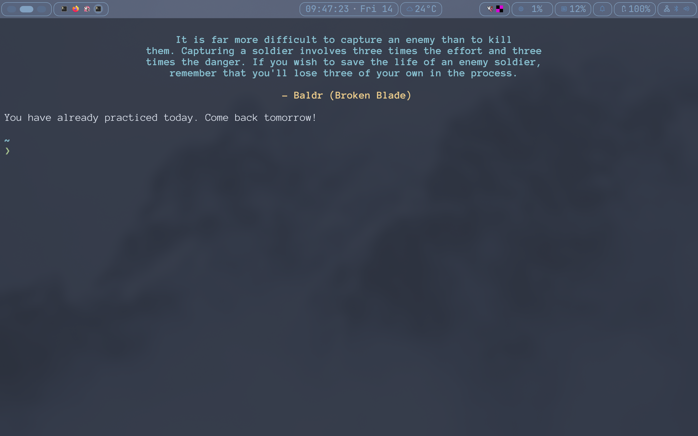
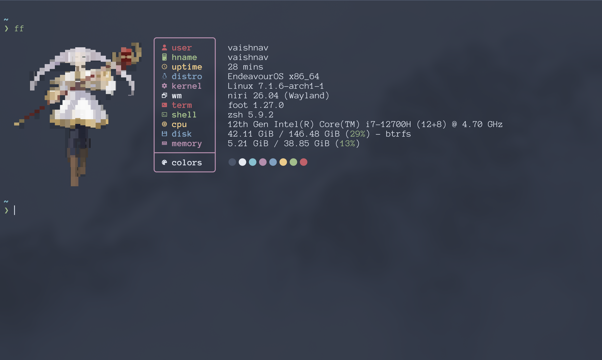
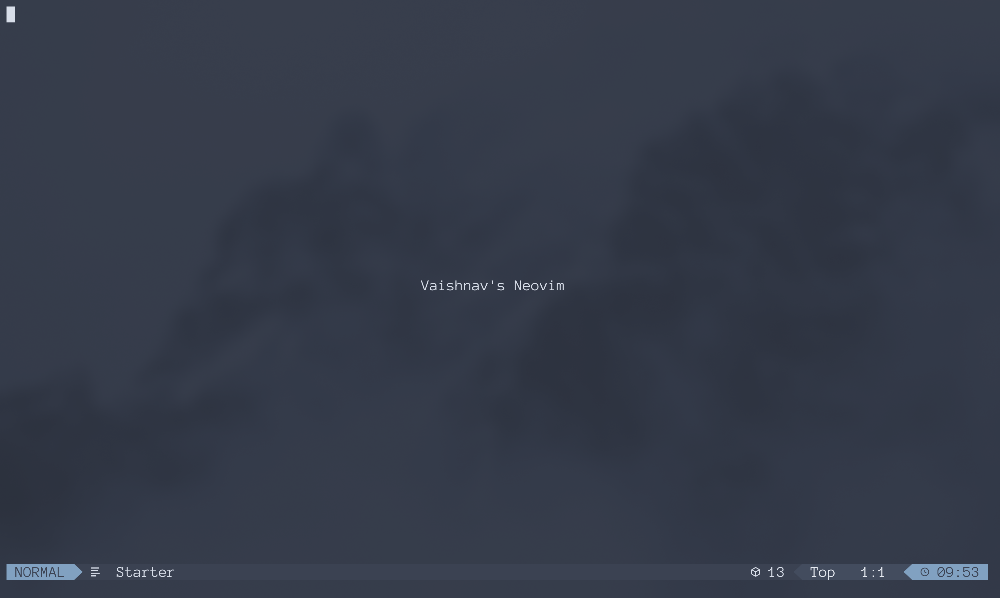
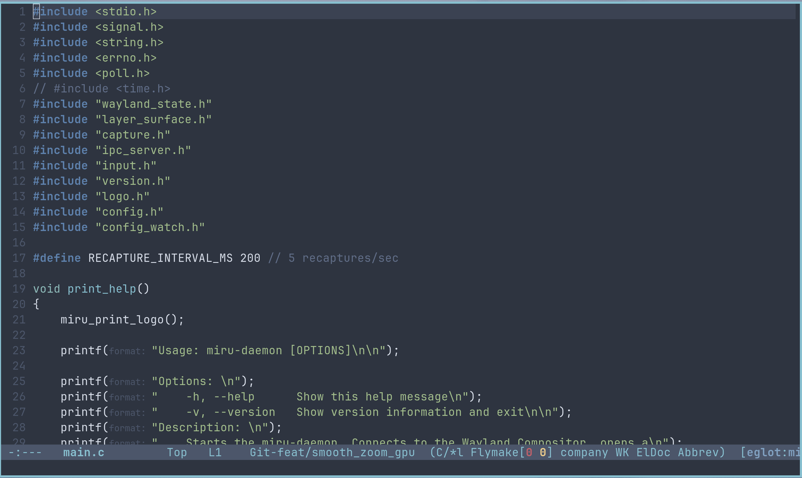

# My Dotfiles

Contains the dotfiles for my Linux system

> [!NOTE]
> Development is done on in [Codeberg](https://codeberg.org/Vaishnav-Sabari-Girish/dotfiles) with a mirror in [GitHub](https://github.com/Vaishnav-Sabari-Girish/dotfiles)

## My Main Tools

1. [Niri](./niri/.config/niri/)
2. [Neovim](./nvim/.config/nvim/)
3. [Emacs](./emacs/.config/emacs/)
4. [Zsh](./zsh/)
5. Terminal Emulators
    1. [Foot](./foot/.config/foot/)
    2. [Wezterm](./wezterm/)
6. [Aliases (Using `amoxide`)](./amoxide/.config/amoxide/)
7. [Fastfetch](./fastfetch/.config/fastfetch/)
8. [Wallpapers](./assets/wallpapers/)
9. [`mpv`](./mpv/.config/mpv/)

## Some Images

| Terminal Emulator | Fastfetch |
| -------------- | --------------- |
|  |  |

| Neovim | Emacs |
| -------------- | --------------- |
|  |  |

### Wallpapers

<table>
  <thead>
    <tr>
      <!-- Spans across 2 columns -->
      <th colspan="2">Wallpapers</th>
    </tr>
  </thead>
  <tbody>
    <!-- First Row of Wallpapers -->
    <tr>
      <td>
        
      </td>
      <td>
        
      </td>
    </tr>
    <!-- Second Row of Wallpapers -->
    <tr>
      <td>
        
      </td>
      <td>
        
      </td>
    </tr>
    <tr>
      <td>
        
      </td>
      <td>
        
      </td>
    </tr>
  </tbody>
</table>
