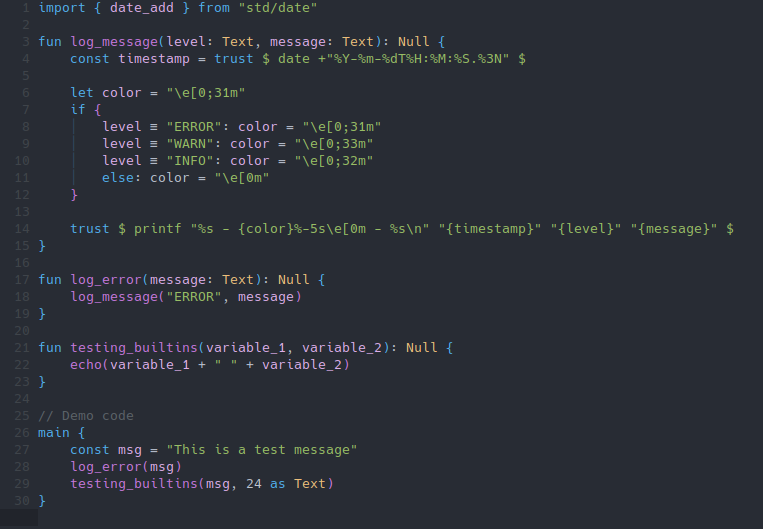
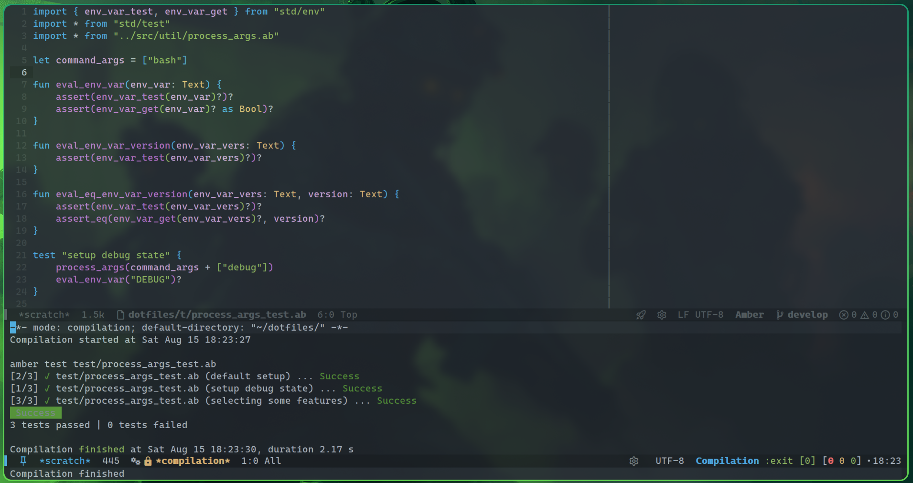

#+title: Amber-mode
#+author: Georgios Davakos
#+language: en

An Emacs major-mode for syntax highlighting and automatic indentation when working with the [[https://amber-lang.com/][Amber programming language]]. Requires Emacs 26.1 or later.

** Installation
*** MELPA (wip)
The package is available on [[https://melpa.org/#/getting-started][MELPA]]. Add this to your init.el.

#+begin_src emacs-lisp
(use-package amber-mode)
#+end_src

*** Manually
If you can't access MELPA (or if the package isn't available there) you can manually install ~amber-mode~ by cloning the repo.
Then add the following in your ~init.el~

#+begin_src emacs-lisp
(unless (version< emacs-version "26")
  (add-to-list 'load-path "~/path/to/your/amber-mode/")
  (autoload 'amber-mode "amber-mode" nil t)
  (add-to-list 'auto-mode-alist '("\\.ab\\'" . amber-mode)))
#+end_src

** Features
As of the time of writing, ~amber-mode~ can do the following:
- Syntax highlighting
- Automatic indentation
- Able to run the amber binary from emacs

*** Syntax highlighting
#+CAPTION: Syntax highlighting example
#+NAME: syntax-highlighting

*** Running the Amber binary
You can use the functions ~amber-check~, ~amber-test~, ~amber-run~ or ~amber-build~ to use the amber binary on your code. These function will run your code from the root directory of your project.

By default each function is bound to:
 * ~C-c C-c c~ ~amber-check~
 * ~C-c C-c t~ ~amber-test~
 * ~C-c C-c r~ ~amber-run~
 * ~C-c C-c b~ ~amber-build~

   
